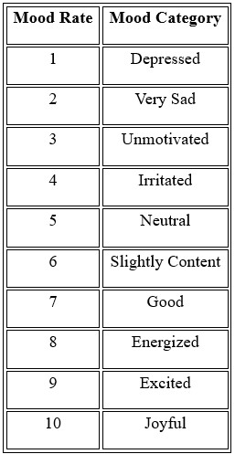
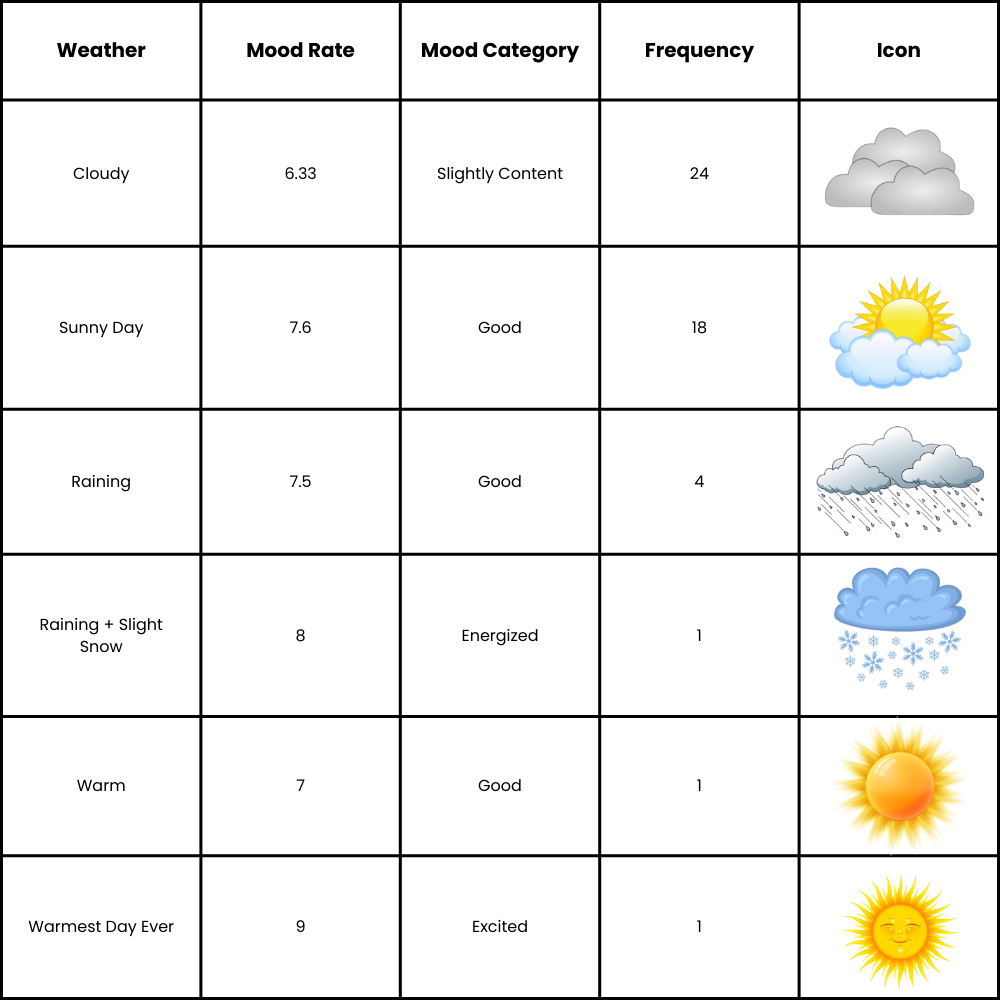

<html lang="en">
<head>
    <meta charset="UTF-8">
    <meta name="viewport" content="width=device-width, initial-scale=1.0">
    <title>"Am I Really Okay?": A Data-Driven Challenge to My Assumptions About Homesickness</title>
    
</head>
<body>
    <h1>"Am I Really Okay?": A Data-Driven Challenge to My Assumptions About Homesickness</h1>

    <h2>Introduction</h2>
    
When I first left Indonesia to begin my Erasmus Mundus journey across Europe, I believed I was well-prepared—mentally, emotionally, and academically. I thought of myself as adaptable, curious, and resilient. After all, I had grown up in Jakarta, a fast-paced and unpredictable city, which I assumed had taught me how to cope with change. I convinced myself that homesickness would not be an issue. I did not see myself as someone who clung to routine or felt deeply tied to a specific environment. However, as I entered my second semester—having spent the first in Glasgow navigating my first-ever winter—I began to question the accuracy of that self-perception.

    
    
It was only through systematic mood tracking, conducted between January and March 2025, that a more layered emotional narrative began to emerge. What I had initially seen as a simple act of self-reflection soon deepened into a critical exploration of emotional adaptation, cultural displacement, and the quiet persistence of homesickness. As Davidson (2005) observes, affect is deeply spatial and contextual—often not expressed through dramatic shifts, but through the ordinary rhythms of daily life. In my case, homesickness did not announce itself; it surfaced quietly in fruit cravings, silent days, the heaviness after video calls, and the unexpected lift sparked by sunshine or a familiar meal.

    <h2>Methodology</h2>
    <h3>Data Collection</h3>
    
Between 20 January and 20 March 2025, I manually collected emotional data using a self-logging system designed to track and contextualise daily mood fluctuations. Each evening, I entered data into a structured Microsoft Excel spreadsheet, capturing both quantitative and qualitative dimensions of emotional experience. The core fields included:

    <ul>
        <li><strong>Mood Rating (1–10):</strong> A self-assigned numerical score reflecting the day's emotional intensity or overall wellbeing, adapted from subjective well-being scales often used in affective research.</li>
        <li><strong>Mood Category:</strong> A qualitative label aligned with each numeric value (e.g., 1 = Depressed, 10 = Joyful), translating abstract scores into accessible emotional language.</li>
        <li><strong>Location:</strong> City- or site-specific information that situated emotional states within particular spatial and social contexts.</li>
        <li><strong>Weather Description:</strong> Daily notes on observable weather conditions (e.g., sunny, cloudy, raining), allowing for later exploration of possible environmental correlations.</li>
        <li><strong>Daily Notes:</strong> Short written reflections capturing subjective interpretations of emotional triggers or notable events from the day.</li>
    </ul>

    
    
Mood Scale Reference Table

    <h3>Visualisation Tools</h3>
    
To interpret and present the dataset meaningfully, I adopted a multi-platform visualisation strategy that combined quantitative clarity with qualitative depth:

    <ul>
        <li><strong>Flourish</strong> was used to create an interactive daily mood timeline and compare mood across locations. Its data storytelling capabilities allowed me to observe temporal patterns and link emotional fluctuations with key moments in time.</li>
        <li><strong>uMap (OpenStreetMap)</strong> enabled me to plot my movements and emotional states across various Irish cities, resulting in a personalised emotional map. This spatial method resonates with developments in emotional geography, where feelings are understood as shaped by, and shaping, the spaces we inhabit.</li>
        <li><strong>Canva</strong> supported the design of a weather–mood infographic. Its intuitive interface allowed me to visually translate correlations between weather conditions and emotional states into accessible and engaging graphics.</li>
    </ul>
    
Each tool helped to make abstract emotional data more tangible. This multimodal approach supported both pattern recognition and deeper reflection, revealing connections that might have remained obscured through written data alone.

    <h3>Subjectivity, Ethics, and the Practice of Mood Tracking</h3>
    
As helpful as mood tracking was, I quickly realised that turning feelings into numbers is not as straightforward as it seems. Emotions are messy, layered, and often hard to define—so assigning a single score to a whole day sometimes felt limiting. There were days when simply reflecting on how I felt ended up changing my mood: writing a '5' might make the day feel worse, or rating it an '8' could help me see the good in it. This made me think about how tracking is not just recording—it is shaping the experience too. There is also something vulnerable about logging emotions every day. As Lupton (2016) points out, self-tracking is shaped by social ideas—about being productive, balanced, or in control. Recognising this helped me see that the data was not absolute truth—it was a reflection shaped by mood, memory, and the act of paying attention. These reflections made me more intentional about how I tracked my moods each day.

    
Although several mood tracking apps were available, I deliberately chose a manual system to ensure deeper engagement with my emotional state. This decision allowed me to critically reflect while inputting the data, rather than passively relying on algorithms. However, manual tracking had its limitations. Some days, especially during high-stress periods, I either forgot to log my mood or struggled to quantify complex emotions with a single number. To address this, I added detailed notes and adjusted the rating afterward to maintain reliability.

    <h2>Daily Mood Timeline: Perception vs. Emotional Reality</h2>
    
At the outset, I considered myself emotionally stable and well-adjusted. However, the mood data I collected over time reveals a more nuanced and layered emotional landscape. The visualisation below illustrates a subtle yet significant evolution in my mood throughout the months.

    

        <iframe src='https://public.flourish.studio/visualisation/22669787/' frameborder='0' scrolling='no' style='width:100%;height:600px;'></iframe>
    

    
On the surface, my average monthly mood appears to improve steadily:

    <ul>
        <li>January: 5.6 (neutral to slightly content),</li>
        <li>February: 6.6 (slightly content to good),</li>
        <li>March: 7.4 (good to energized).</li>
    </ul>
    
This progression suggests a positive adaptation to my new environment. Yet, what these numbers fail to reveal is the emotional complexity underlying my experience.

    <h3>Subtle Emotional Currents</h3>
    
Although I did not experience homesickness in the traditional sense—longing for familiar food, weather, or language— there were moments in Ireland that triggered emotions tied to my home context. These instances align with Berry's (1997) concept of acculturation stress, where the psychological strain of adjusting to a new culture is compounded by the need to preserve elements of one's original identity.

    <h4>Visa and Residency Stress</h4>
    
The stress of navigating immigration processes on my own resulted in significant mood drops, especially during moments of ambiguity and administrative delays. The complex procedures and constant need to ensure compliance with regulations left me feeling isolated and overwhelmed. While this was not homesickness in the traditional sense, it highlighted a deeper emotional gap—the absence of familial support, which typically provides emotional reassurance and stability during times of stress. Without the comforting presence and reassurance of my family, I felt more vulnerable and exposed to the emotional toll of managing such bureaucratic challenges alone. This experience aligns with Lazarus and Folkman's (1984) theory of coping and appraisal, which suggests that the lack of social support can intensify stress and negatively impact emotional well-being. In this case, the challenge of navigating a foreign system without immediate family by my side created a distinct emotional strain, which I had not anticipated when first imagining my experience abroad.

    <h4>Post-Call Emptiness</h4>
    
After video calls with family, I often felt a delayed emotional dip—what I came to think of as an "emotional aftershock." During the call, everything felt normal, but afterward, reality set in. I realized how far away I was—not just in distance, but in time zones too. The simple act of missing them became more profound because I could not just hop over to my parents' home when I miss them. This experience reflects what it means to live as an international student, caught between two cultures, struggling to balance both identities. It also connects with Hochschild's (1983) idea of emotional labour, where you constantly manage your emotions to meet the demands of both social and academic expectations.

    <h4>Buying Fruit as Comfort</h4>
    
On days when I felt low, I often ended up buying lots of fruit—not out of a sudden craving, but because it brought me a quiet sense of comfort. Since childhood, having fresh fruit at home was part of my everyday life. My parents and I would eat fruit together during breakfast and dinner—not just one kind, but a mix they always made sure to have. It was not just about the food—it was also a moment when we shared stories and talked about our day. Without realizing it, I started recreating that habit in Ireland. Whenever I felt sad or disconnected, I found myself buying fruit in bulk. This reflects the idea of embodied memory, where familiar sensory experiences like taste or smell quietly reconnect us to feelings of belonging and home.

    <h4>Cultural Connection and Uplift</h4>
    
My mood consistently lifted on days when I engaged with parts of Indonesian culture—but not necessarily through the food itself. What I truly missed was the activity of cooking together. Back home, weekends were often spent in the kitchen with my parents, making simple dishes like fried rice or stir-fried vegetables, while chatting and laughing along the way. It was a shared ritual that made me feel close to them. In Glasgow, I had many friends and found it easier to build those social bonds. But in Ireland, it has been harder to make connections, and that sense of togetherness through cooking became something I deeply longed for. These small acts of cultural connection reminded me who I was beyond my academic role—they gave me a sense of stability and belonging when everything else felt unfamiliar.

    <h2>Location and Emotional Geography</h2>
    
As an Erasmus student, travelling felt like more than just sightseeing—it became part of how I coped and made sense of my experience. It felt like both a symbolic and practical way to find emotional balance. I started with the idea that exploring new places might help me feel better, and the data I collected supported that. The visualisations below illustrate how movement across locations correlated with consistent mood improvements.

    

        <iframe src='https://umap.openstreetmap.fr/en/map/mood-journey_1208001' frameborder='0' scrolling='no' style='width:100%;height:600px;'></iframe>
    

    

        <iframe src='https://public.flourish.studio/visualisation/22671625/' frameborder='0' scrolling='no' style='width:100%;height:600px;'></iframe>
    

    <h3>Observations</h3>
    
Exploring new places had a clear impact on my emotional state. Cities like Kinsale, Midleton, and Cobh were consistently linked with higher mood scores. These trips were more than just breaks—they gave me a sense of lightness and freedom that was often missing from my daily routine. This supports the idea of therapeutic mobility, where moving through space—especially unfamiliar or scenic environments—can help lift emotional weight and bring a renewed sense of wellbeing (Gatrell 2013). These moments of exploration offered not only just something new but also a kind of emotional reset, giving me distance from the quiet pressures of routine-based stress.

    
On the other hand, days spent entirely in familiar spaces like my accommodation or the university saw mood scores settle between 4 and 7. While these were not especially joyful days, they were emotionally steady. These moments reflect what Bissell (2011) describes as the comfort of habitual dwelling—where the predictability of everyday routines provides a sense of control and calm. This contrast between the uplifting effect of movement and the grounding effect of routine shows how both new experiences and familiarity play important roles in emotional regulation during transitional life stages like studying abroad.

    
These observations do not negate my original assumption about the emotional benefits of travel. Rather, they extend it: emotional intensity is not solely a function of location or adventure, but also of affective resonance.

    <h2>Weather and Mood: A Tropical Mind in a Cloudy Land</h2>
    
Coming from a tropical country, I initially thought I would easily adapt to the European weather—and, in many practical ways, I did in Glasgow. I was not particularly sensitive to the cold and did not feel the need for heavy thermal layers like many of my peers. However, my mood data told a more nuanced story, especially when it came to sunlight. The emotional impact of weather was not something I had fully anticipated. While I could handle the chill, the lack of consistent sunlight had a deeper effect on my mood than I expected.

    
    
Weather Table: Mood Correlation

    
On 30 January, I experienced my first sunlight in weeks, and it made a noticeable difference. While I never complained about the cloudy or rainy days, I had not fully realized how much I missed sunlight until I felt it again. The warmth was familiar, almost like home, and even though the day was not particularly eventful, the sun lifted my spirits. By 15 March, the warmest day I had experienced in Europe so far, the sunshine brought a new wave of energy. It was not just about the weather; the sunlight reminded me of the changing seasons and opportunities in my life, underscoring how deeply weather can impact emotional well-being in ways I had not anticipated since leaving Indonesia last September.

    
This personal experience reflects patterns found in environmental psychology, where natural elements—especially sunlight—play a significant role in regulating emotional states. While I was not clinically affected by the lack of light, the data aligns with theories of Seasonal Affective Disorder (SAD), which suggest that reduced daylight can lower serotonin levels and disrupt mood regulation (Rosenthal et al., 1984). Interestingly, my emotional responses were not driven by extreme weather events, but by subtle atmospheric shifts. Even brief moments of sunshine or mild warmth had a noticeable impact, highlighting the concept of embodied cognition. Bodily states—such as warmth, light exposure, and sensory familiarity—directly influence emotional experience, more than I had realized.

    
Reflecting on these observations, it became clear that my body had adapted to tropical weather more profoundly than I had consciously acknowledged. While I had rationally accepted the grey skies as part of the European experience, emotionally, I responded in ways deeply rooted in my climatic memory and sensory expectations of "home." These findings reinforce the idea that emotional well-being is not just a cognitive process—it is experienced through the body, the skin, and the senses. As Tuan (1974) suggests in his work on emotional geography, place is not just where we are, but how we feel in relation to it.

    <h2>Conclusion</h2>
    
This reflective analysis demonstrates that emotional well-being during a study abroad experience is shaped by more than broad categories like culture shock or homesickness. Through the process of tracking and visualising my emotional data, I came to understand that emotional adjustment is a layered and dynamic process, influenced by subtler factors: changing weather, everyday rituals, sensory memories, and the emotional weight of bureaucratic stress. While I believed I was mentally prepared for life abroad, the data revealed gaps between how I perceived myself and how I actually felt. These insights disrupted my assumption of resilience and forced me to reconsider how belonging, comfort, and identity operate on both conscious and unconscious levels.

    
Visualising these emotions helped surface patterns I might have otherwise ignored, such as the lift I felt when exploring new places or the comfort found in replicating routines from home. This project has shown me that data is not just a mirror, but a lens—it can both reflect and reveal. Going forward, I see self-tracking not as a tool for optimisation, but as a gentle way to check in with myself and navigate future transitions with more clarity and compassion.

    

        <h2>References</h2>
        <ul>
            <li>Ahmed, Sara. 2004. <em>The Cultural Politics of Emotion.</em> Edinburgh: Edinburgh University Press.</li>
            <li>Berry, John W. 1997. "Immigration, Acculturation, and Adaptation." <em>Applied Psychology</em> 46 (1): 5–34.</li>
            <li>Bissell, David. 2011. "Thinking Habits for Uncertain Subjects: Movement, Stillness, Susceptibility." <em>Environment and Planning A</em> 43 (11): 2649–65.</li>
            <li>Davidson, Joyce. 2001. "Embodying Emotion Sensing Space: Introducing Emotional Geographies." <em>Social & Cultural Geography</em> 2 (4): 441–56.</li>
            <li>Davidson, Joyce. 2005. <em>Emotional Geographies.</em> Edited by Joyce Davidson, Liz Bondi, and Mick Smith. Aldershot: Ashgate.</li>
            <li>Hochschild, Arlie Russell. 1983. <em>The Managed Heart: Commercialization of Human Feeling.</em> Berkeley: University of California Press.</li>
            <li>Lazarus, Richard S., and Susan Folkman. 1984. <em>Stress, Appraisal, and Coping.</em> New York: Springer.</li>
            <li>Lupton, Deborah. 2016. <em>The Quantified Self: A Sociology of Self-Tracking.</em> Cambridge: Polity Press.</li>
            <li>Rosenthal, Norman E., David A. Sack, John C. Gillin, Alfred J. Lewy, Terry A. Goodwin, F. K. Davenport, Peter S. Mueller, and Thomas Wehr. 1984. "Seasonal Affective Disorder: A Description of the Syndrome and Preliminary Findings with Light Therapy." <em>Archives of General Psychiatry</em> 41 (1): 72–80.</li>
            <li>Tuan, Yi-Fu. 1974. <em>Topophilia: A Study of Environmental Perception, Attitudes, and Values.</em> New York: Columbia University Press.</li>
        </ul>
    

</body>
</html>
